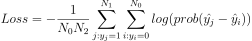

# Classification metrics optimization

#### library that support Logloss optimization

* Tree-based

  > `XGBoost`,` LightGBM`
  >
  > ~~`sklearn, RandomForetClassifier`~~

* Linear model

  > `sklearn.<>Regression`
  >
  > `sklearnSGDRegressor`
  >
  > `Vowpal Wabbit`

* Neural nets

  > `PyTorch`, `Keras`, `TF`, etc

 

#### Correct probabilities

* Take all objects with score e.g. ~0.8
  * 80% of them of class 1
  * 20% of them class 0

Incorrect probabilities:

* Take all objects with score e.g. ~0.8
  * 50% of them of class 1
  * 50% of them of class 0

 

#### library that support AUC optimization

- Tree-based

  > `XGBoost`,` LightGBM`
  >
  > ~~`sklearn, RandomForetClassifier`~~

- Linear model

  > ~~`sklearn.<>Regression`~~
  >
  > ~~`sklearnSGDRegressor`~~
  >
  > ~~`Vowpal Wabbit`~~

- Neural nets

  > `PyTorch`, `Keras`, `TF` -- not out of the box

 

#### Pairwise Loss

There exists an algorithm to optimize AUC with gradient-based methods: **Pairwise loss**

 