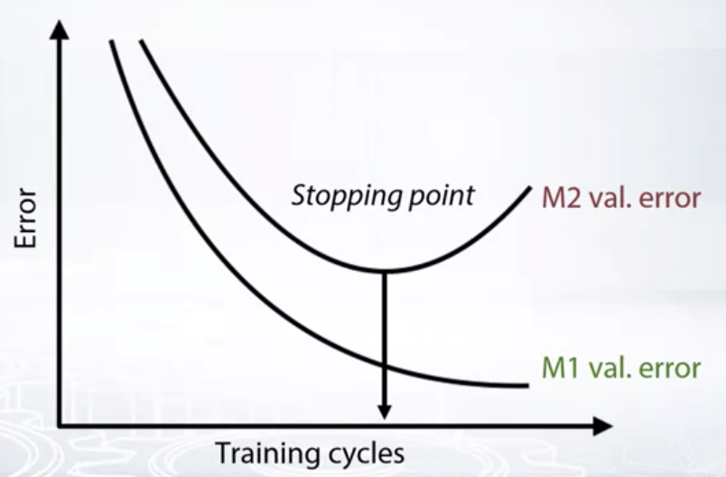

# Week 3 Note

## Metrics optimiation

>If your model is scored with some metric, you get best results by optimizing exactly that matric

#### Regression Matrics Review

>  [more detail about regression matrics review](Regression-metric-review.md)

* MSE, RMSE, R-squared (Synonyms: **L2 loss**)
  * They are the same from optimization perspective
* MAE (Synonyms: **L1 loss, Median regression**)
  * Robust to outliers, much less biased
* MSPE, MAPE
  * Weighted version of MSE/MAE
  * biased towards smaller targets because they assign higher weight to the object with small targets.
* RMSLE
  * MSE in log space
  * frequently considered as better metrics than MAPE, since it is less biased towards small targets, yet works with relative errors.

MAE is more robust than MSE (it is not that influence by outliers, doesn’t mean it’s always better use MAE then MSE)

- Do you have outliers in the data?  use MAE
- Are you sure they are outliers?  use MAE
- Or they are just unexpected values we should still care about?  use MSE

 

#### Classification metrics review

> [More detail about classification  matrics review](Classification-matric-review.md)

* Accuracy
* Logloss
* AUC (ROC)
* Cohen's  (Quadratic weighted) Kappa

classification materials

- [Evaluation Metrics for Classification Problems: Quick Examples + References](http://queirozf.com/entries/evaluation-metrics-for-classification-quick-examples-references)
- [Decision Trees: “Gini” vs. “Entropy” criteria](https://www.garysieling.com/blog/sklearn-gini-vs-entropy-criteria)
- [Understanding ROC curves](http://www.navan.name/roc/)

 

#### General approaches for metrics optimization

- Just run the right model!
  - MSE, Logloss
- Preprocess train and optimize another metric
  - MSPE, MAPE, RMSLE, .....
- Optimize another metric, postprocess predictions
  - Accuracy, Kappa
- Write custom loss function
  - Any, if you can
- Optimize another metric, use early stopping
  - Any

 

**early stopping**: Optimize metric M1, monitor metric M2, stop when M2 score is the best.

 

#### Regression metrics optimization

- Use weights for samples (`sample_weights`)
  - And use MSE (MAE)
  - Not every library accepts sample weights
    - XGBoost, LightGBM accept
    - Neural nets: Wasy to implement if not supported
- Resample the train set
  - `df.sample(weights=smple weights)`
  - And use any model that optimizes MSE (MAE)
  - Usually need to resample many times and average

[Here are some of the library that support mean square error optimization](Regression-metrics-optimization.md)

 

MSPE(MAPE) as weighted MSE(MAE)

 

#### Classification metrics optimization

Probability calobration

* Platt scaling
  * Just fit Logistic Regression to your predictions (like in stacking)
* Isotonic regression
  * Just fit Isotonic Regression to your predictions (like in stacking)
* Stacking
  * Just fit XGBoost or neural net to your predictions

[Here are some of the library that support classification matrics (Logloss & AUC) optimization.](Classification-metrics-optimization.md) There exists an algorithm to optimize AUC with gradient-based methods: **Pairwise loss**

 

To optimize Quadratic weighted Kappa

* optimize MSE and find the right thresholds

  * Simple

  * Optimize MSE

    

  * Find right threshold

    * Bad: `np.round(prediction)`
    * Better: optimize thresholds

* Custim smooth loss for GBDT or neural nets

  * Harder

 

Ranking materials

- [Learning to Rank using Gradient Descent](http://icml.cc/2015/wp-content/uploads/2015/06/icml_ranking.pdf)-- original paper about pairwise method for AUC optimization
- [Overview of further developments of RankNet](https://www.microsoft.com/en-us/research/wp-content/uploads/2016/02/MSR-TR-2010-82.pdf)
- [RankLib](https://sourceforge.net/p/lemur/wiki/RankLib/)(implemtations for the 2 papers from above)
- [Learning to Rank Overview](https://wellecks.wordpress.com/2015/01/15/learning-to-rank-overview)

clustering

- [Evaluation metrics for clustering](http://nlp.uned.es/docs/amigo2007a.pdf)

 

## Mean Encoding

Using target to generte features (mean of target value in the same feature label). Why it work?

* Label encoding gives random order. No correlation with target.
* Mean encoding helps to seperate zeros from ones

Goods - numbrt of ones in group

Bads - number of zeros in group

* $Lijelihood = \frac{Goods}{Goods+Bads}=mean(target)$
* $Weight of EvidencE = ln(\frac{Goods}{Bads}*100)$
* $Count=Goods=sum(target)$
* $Diff=Goods=Bads$

We need to deal with overfitting first, means we need some regularization.

* CV loop inside training data (KFold, LOO)

  * Robust and intuitive
  * Usually decent result with 4-5 folds across different datasets  (KFold scheme)
  * Need to be careful with extreme situations like LOO
  * Perfect feature for LOO scheme
  * Target variable leakage is still present even for KFold scheme

* Smoothing 

  - Alpha controls the amount of regularization

  - Only works together with some other regularization method

    $\frac{mean(target)*nrows+globalmean*alpha}{nrows+alpha}$

* Adding random noise

  * Noise degrades the quality of encoding
  * How much noise should we add?
  * Usually used together with LOO

* Sorting and calculating expanding mean.

  * Least amount of leakage
  * No hyper parameters
  * Irregular encoding quality
  * Build - in CatBoost

 

Conclusion

* There are a lot ways to regularize mean encodings
* Unending battle with target variable leakage
* CV loop or Expanding mean for practical task

 

#### Extension and generalizations

* Using target variable in different task. Regression, multiclass
  * More statistics for regression tasks. Percentiles, std, distribution bins.
  * Intorducing new information for one 
* Domains with many-tomany relations
* Timeseries
* Encoding interactions and numerical features

 

#### Correct validation remonder

* Local experiments:
  * Estimate encodings on X_tr
  * Map them to X_tr and X_val
  * Regularize on X_tr
  * Validate model on X_tr/X_val split
* Submission:
  * Estimate encodings on whole Train data
  * Map them to Train and Test
  * Regulatize on Train
  * Fit on Train

 

**Mean encoding concludsion**

- Main advantages
  - Compact transmation of categorical variables
  - Powerful basis for feature engineering
- Disadvantages
  - Need careful validation, there a lot of ways to overfit
  - Significant improvements only on specific datasets

Regularization - Smoothing 

* Alpha controls the amount of regularization
* Only works together with some other regularization method